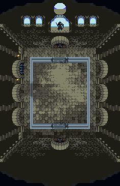
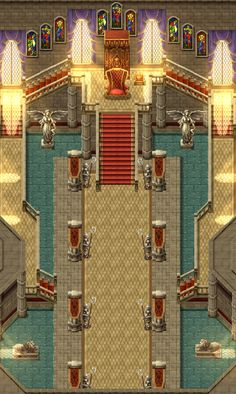
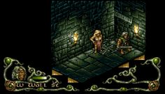
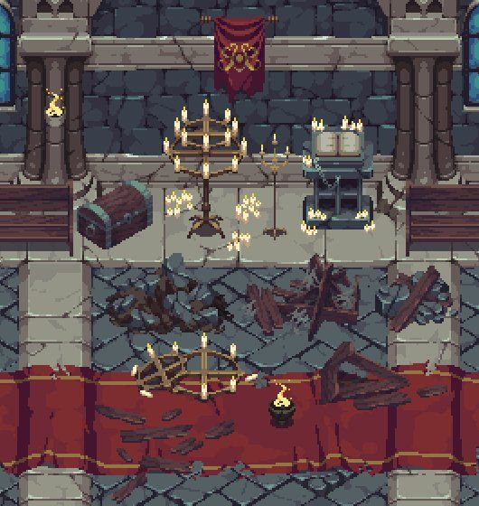

# REIGN OF REBELS

## BY DUNGEON DEFENDERS
## MEMBERS: 
Allyssa Rose Dacanay- 2407068, 

Saleha (Suha) Uddin- 2401224, 

Han Lacson- 101050402, 

Imogen Kingston-, 

Amelia Harrison- 101052216,

Anna Kuangnarin- 101061469

## OVERVIEW OF OUR GAME: 
 In our game “Reign of Rebels” the player takes on the role of a rebel aiming to overthrow the ruler and place their leader on the throne. To achieve this, they must embark on a quest to steal three sacred objects – a Sceptre, a Robe, and a Crown – each held in a different location, which would be the Dungeons, Main Hall and the Throne Room, each guarded by a series of obstacles and trials. 

Each object is essentially a level in the game, once the player manages to obtain an object required to overthrow the ruler, they move onto another stage where they repeat the whole process, except they manage to acquire another piece of the three objects; until they get to the final stage, where they face the King (who is the ultimate boss of the game), and secure the King crown.

## ROLES & INDIVIDUAL CONTRIBUTIONS
**Han: Main Coder/ Maps Coder-**
My role for this project is to create and code the main map of the game ensuring that each level and aspect of the map is in order, in terms of its assets and properties. Furthermore, I have the role of main coder where I manage and troubleshoot any issues with our code.

I have contributed in coding with the prototype of the game's tilemap and have used some of the map designs created by Amelia, in order, to add the graphics of the map. I took this from the week 15, 16 and 17 workshops. I have also managed to fix some errors such as there was an issue with player walking through walls, which has now been fixed. Furthermore, I have also organised the coding so it is easier to read and understand. 

Overall, I have so far enjoyed experimenting with the code and I find it satisfying when I can solve issues and problems within the code. 

**Imogen: Designer for enemy sprites/ Coder for enemy sprites-**

**Allyssa: Story writer/Coder for player, scroll screen and game over screen-**
I have taken on the role of creating the narrative of the game where I sort of proposed the basis of the backstory of the entire game, which is essentially the whole idea of a rebellion attempting the overthrow the king. But in order to do this, they must obtain these three objects which are each contained in three different locations within the king's fortress. 

In order to introduce this narrative to the players of the game, I have created a scroll which will be presented right before the player enters the first level of the game, and it contains a message from the leader of this rebellion group, explaining to the player the main objective of the game and what they'll be facing in order to achieve the goal of overthrowing the king. 

I have also contributed to coding the moving character on the tilemap, by importing the character designed by Amelia into VS code and implementing some of the code learnt from Week 17 to achieve this. 

Overall, I have enjoyed the process of creating the narrative a lot, as well as coding both the scoll message page and the moving character.

**Suha: Designer for items/ Coder for Items, some dialogue-**

**Anna: Designer for assets/ Coder for Story, Map Assets, some dialogue-**

**Amelia: Designer for character, tile maps/ Coder for Intro screen, story-**

## THEMES
Theme of Dungeons, Rebellion, Monarchy, etc. We're essentially aiming for a dark, scary atmosphere/mood within the game. 

## GAME DESIGN: 
**Level Structures:** The game consists of multiple levels, each representing a different area within the ruler's fortress. One of the levels include the Dungeons, which is where the player will face the task of defeating several enemies and obstacles in order to obtain the sceptre. After successfully getting through this level, the player then moves onto the next level, which would be the main hall, where they would again have to face multiple enemies and obstacles protecting the cape. Once they get to the final level, which is the throne room, they are then not only faced with the enemies and obstacles, they are also faced with the King, who is the ultimate boss of the entire game. 

**Movement/Combat:** The player will be able to use the WASD keys to move the character around; and since they will be engaging in combat with various enemies, they would be able to use a knife by clicking on their mouse to aim and deal damage to those attacking them. Players may also potentially deal damage or be poisoned by various objects/assets scattered around the map, and would be able to overcome these obstacles by spamming a key on the keyboard. They player will have around 3 lives, before they end up dying and restarting the game again. 

## AESTHETIC
Main aestheitc/atmosphere we are aiming for: 

 